```mermaid
flowchart TD
    S01["Step 1: Dynamic Config Engine (config.py)"] --> S02["Step 2: Provider Adapters & Circuit Breakers"]
    S02 --> S03["Step 3: Dynamic Zero-Cost ParetoRouter"]
    S03 --> S04["Step 4: Hermes Core While-Loop & Context Compressor"]
    S04 --> S05["Step 5: Dynamic Tool Registry & Schema Auto-Discovery"]
    S05 --> S06["Step 6: Filesystem Tools & SAGA Undo Snapshots"]
    S06 --> S07["Step 7: Windows OS, Window & Process Tools"]
    S07 --> S08["Step 8: Sandboxed Terminal & ConPTY Runner"]
    S08 --> S09["Step 9: Browser (Patchright), Media & Documents"]
    S09 --> S10["Step 10: Dual-Tier Memory (MEMORY.md + SQLite-vec)"]
    S10 --> S11["Step 11: Dynamic Markdown Skills & Self-Evolution"]
    S11 --> S12["Step 12: Gateway Daemon Core & User Allowlists"]
    S12 --> S13["Step 13: Telegram & Discord Adapters"]
    S13 --> S14["Step 14: WhatsApp Linked-Device & Email Adapters"]
    S14 --> S15["Step 15: Gemini 3.8 Live Bidirectional Audio Stream"]
    S15 --> S16["Step 16: Local SoundDevice I/O, Edge-TTS & Whisper"]
    S16 --> S17["Step 17: Rich / Typer Interactive Terminal CLI"]
    S17 --> S18["Step 18: FastAPI WebSocket Server & Desktop UI"]
```

# 📋 Makima v2 — Chronological Build Sequence & Dependency Graph
> **Architecture**: Nous Research Hermes Agent Pattern + Dynamic Zero-Cost Pareto Routing  
> **Rule**: Every step must have a TODO list, Data Flow Map, and a Live Verification Test before moving to the next.

---

---

## 🏗️ The 18 Chronological Build Steps (Puri List)

### 🟢 PHASE 1: The Brain & Model Gateway (Steps 1 – 4)
*Pehle foundation banegi taaki LLM bol sake aur tool call decide kar sake.*

#### Step 1: Dynamic Configuration Engine (`makima/config.py`)
- **Kyun Pehle?**: Har agle module ko settings, paths aur keys chahiye.
- **Kya Banega**: `Pydantic-settings` class jo `settings.yaml` aur `.env` load karegi bina hardcoded paths ke.
- **Callers**: Sabhi modules.
- **Verification**: `tests/verify_config.py` (Settings load honge, env override test hoga).

#### Step 2: Provider Strategy Adapters & Circuit Breakers (`makima/provider/`)
- **Kyun Next?**: Model call karne ke liye wire-format adapters chahiye.
- **Kya Banega**:
  - `circuit_breaker.py`: 3-state failure breaker (closed/open/half_open with jitter).
  - `adapters/base.py`: Abstract `BaseProvider` (`generate()`, `stream()`).
  - `adapters/gemini.py`: Google GenAI SDK adapter (Gemini 2.5 Flash free tier).
  - `adapters/openai_compatible.py`: Groq free tier, OpenRouter free, Cerebras, Ollama.
- **Callers**: ParetoRouter (`router.py`).
- **Verification**: `tests/verify_providers.py` (Mock & real test calls, error handling).

#### Step 3: Dynamic Zero-Cost ParetoRouter (`makima/provider/router.py`)
- **Kyun Next?**: Task ke basis par best free model auto-select karne ke liye.
- **Kya Banega**:
  - Task cascades (`fast_chat`, `code`, `deep_reasoning`, `vision`).
  - Active key discovery + Ollama `/api/tags` probing.
  - Sorting key: `(is_preferred, task_idx, latency_tier, ewma_ms, fail_count)`.
- **Callers**: Core Agent Engine (`engine.py`).
- **Verification**: `tests/verify_router.py` (Cascade selection, rate-limit auto fallback).

#### Step 4: Hermes Core While-Loop & Context Compressor (`makima/core/engine.py`)
- **Kyun Next?**: Ab jab LLM ready hai, tab uska autonomous execution loop banega.
- **Kya Banega**:
  - Transparent while-loop: `Prompt + Tools` → `Model` → `Parse tool calls` → `Execute` → `Append results` → Repeat.
  - `context.py`: Middle-turn compression jab token budget > 75% ho jaye (Head aur Tail intact).
- **Callers**: Gateway daemon, CLI, aur API server.
- **Verification**: `tests/verify_engine.py` (Simulate multi-turn chat with tool calling).

---

### 🟡 PHASE 2: Modular Toolsets & OS Control (Steps 5 – 9)
*Brain ban gaya, ab agent ke haath aur pair (Tools) banenge.*

#### Step 5: Dynamic Tool Registry & Auto-Discovery (`makima/tools/registry.py`)
- **Kyun Next?**: Tools ko bina hardcoding ke register aur discover karne ka system.
- **Kya Banega**:
  - `@tool(name, description, tags)` decorator.
  - `inspect.signature` se Pydantic v2 JSON schema auto-synthesis.
  - Directory scanner (`tools/**/`) jo new files ko dynamically load kare.
  - `[TOOL_FAILED: name]` fallback error generator with alternatives hint.
- **Callers**: Core Engine & all tool modules.
- **Verification**: `tests/verify_tool_registry.py` (Register dummy tool, verify schema auto-creation).

#### Step 6: Safe Filesystem & SAGA Rollback (`makima/tools/filesystem/`)
- **Kyun Next?**: Safe file operations jo workspace ke bahar na jayein.
- **Kya Banega**:
  - `safe_io.py`: Read, write, edit, delete, search with `cwd` boundary check.
  - `saga_rollback.py`: Destructive edit se pehle snapshot lena taaki `undo` command par file restore ho sake.
- **Callers**: Tool Registry → Core Engine.
- **Verification**: `tests/verify_filesystem.py` (Write file, edit, snapshot, undo restore).

#### Step 7: Windows OS, Window & Process Management (`makima/tools/os/`)
- **Kyun Next?**: PC control karne ke basic tools (purane 4300-line God file ka clean version).
- **Kya Banega**:
  - `apps.py`: App search and launch with PID verification.
  - `windows.py`: Window focus, minimize, maximize, snap via `pywin32`.
  - `processes.py`: Process monitor (CPU/RAM) aur safe process kill via `psutil`.
  - `system_info.py`: Battery, disk, hardware diagnostic stats.
- **Callers**: Tool Registry → Core Engine.
- **Verification**: `tests/verify_os_tools.py` (List active windows, get CPU stats).

#### Step 8: Sandboxed Terminal & ConPTY Runner (`makima/tools/terminal/`)
- **Kyun Next?**: Shell commands execute karne ke liye.
- **Kya Banega**:
  - Local async subprocess with timeout and directory clamping.
  - `pywinpty` ConPTY integration on Windows for interactive commands (`[y/N]`).
  - Dangerous command interceptor (`rm -rf`, format).
  - Docker sandbox backend toggle.
- **Callers**: Tool Registry → Core Engine.
- **Verification**: `tests/verify_terminal.py` (Execute safe command, verify dangerous command block).

#### Step 9: Browser, Media & Document Tools (`makima/tools/`)
- **Kyun Next?**: Internet browse karna, music chalana, aur documents banana.
- **Kya Banega**:
  - `browser/`: Patchright stealth Playwright driver & browser-use.
  - `media/`: YouTube & Spotify controller via DOM.
  - `documents/`: OpenPyXL (Excel), Python-DOCX (Word), Python-PPTX (PPT), Playwright `page.pdf()`.
- **Callers**: Tool Registry → Core Engine.
- **Verification**: `tests/verify_browser_media.py` (Generate styled Excel, test headless web fetch).

---

### 🔵 PHASE 3: Dual-Tier Memory & Self-Improving Skills (Steps 10 – 11)
*Agent ko user ke facts yaad rakhna aur naye kaam seekhna sikhana.*

#### Step 10: Dual-Tier Memory Engine (`makima/memory/`)
- **Kyun Next?**: Pure text files + fast vector search.
- **Kya Banega**:
  - Tier 1: `state.py` (`~/.makima/MEMORY.md` & `~/.makima/USER.md` prompt injection).
  - Tier 2: `episodic.py` (Async SQLite WAL database via `aiosqlite`).
  - `vector_search.py`: `fastembed` + `sqlite-vec` on-device semantic search without PyTorch.
- **Callers**: Core Engine.
- **Verification**: `tests/verify_memory.py` (Store turn, search semantically, verify prompt injection).

#### Step 11: Dynamic Markdown Skills Engine (`makima/skills/`)
- **Kyun Next?**: Hermes Agent ka self-improving skill mechanism.
- **Kya Banega**:
  - `loader.py`: Scans `~/.makima/skills/**/*.md` (YAML frontmatter).
  - `synthesizer.py`: `save_learned_skill()` tool — agent task complete karke khud fresh Markdown skill file likh sake.
- **Callers**: Core Engine & Tool Registry.
- **Verification**: `tests/verify_skills.py` (Load skill, trigger agent skill synthesis).

---

### 🟣 PHASE 4: Multi-Platform Messaging Gateway (Steps 12 – 14)
*Agent ko standalone daemon banana jo phone aur chat apps par 24/7 live rahe.*

#### Step 12: Gateway Daemon Core & Security (`makima/gateway/`)
- **Kyun Next?**: Chat platforms ko connect karne wala supervisor process.
- **Kya Banega**:
  - `server.py`: Long-running background daemon runner.
  - `security.py`: User allowlists and pairing code verification.
  - `scheduler.py`: `apscheduler` for recurring cron jobs and reminders.
- **Callers**: CLI command `makima gateway run`.
- **Verification**: `tests/verify_gateway_core.py` (Start daemon, test allowlist auth).

#### Step 13: Telegram & Discord Adapters (`makima/gateway/adapters/`)
- **Kyun Next?**: Sabse popular messaging platforms.
- **Kya Banega**:
  - `telegram.py`: `python-telegram-bot` with voice memo, photo, and command dispatch.
  - `discord.py`: `discord.py` bot with slash commands and channel threads.
- **Callers**: Gateway Server.
- **Verification**: `tests/verify_telegram_discord.py` (Mock incoming message to agent response).

#### Step 14: WhatsApp Web & Email Adapters (`makima/gateway/adapters/`)
- **Kyun Next?**: WhatsApp aur Email integration.
- **Kya Banega**:
  - `whatsapp.py`: Baileys / QR Web Pair Bridge (linked-device without Meta API fees).
  - `email_daemon.py`: Async IMAP listener (unread emails trigger tasks) + SMTP reply dispatcher.
- **Callers**: Gateway Server.
- **Verification**: `tests/verify_whatsapp_email.py`.

---

### 🟠 PHASE 5: Voice & Multimodal Audio (Steps 15 – 16)
*Bina keyboard touch kiye bol kar baat karna.*

#### Step 15: Gemini 3.8 Live Bidirectional Audio (`makima/voice/gemini_live.py`)
- **Kyun Next?**: Real-time sub-300ms speech-to-speech.
- **Kya Banega**:
  - Full-duplex WebSocket stream using `google-genai` (16kHz PCM in → 24kHz audio out).
  - Native barge-in (user ke bolte hi AI ka chup hona) aur in-stream tool execution.
- **Callers**: Voice Daemon / Desktop UI.
- **Verification**: `tests/verify_gemini_live.py`.

#### Step 16: Local SoundDevice I/O, Edge-TTS & Whisper (`makima/voice/`)
- **Kyun Next?**: Windows audio hardware aur offline voice fallback.
- **Kya Banega**:
  - `audio_io.py`: `sounddevice` low-latency mic capture and speaker playback.
  - `edge_tts.py`: Free neural TTS voices for spoken notifications.
  - `whisper_stt.py`: `faster-whisper` on-device STT with Silero VAD.
- **Callers**: Voice Engine.
- **Verification**: `tests/verify_voice_io.py` (Test mic input buffer and speaker playback).

---

### 🔴 PHASE 6: Interfaces & Final Polish (Steps 17 – 18)
*User interfaces aur complete desktop integration.*

#### Step 17: Rich / Typer Terminal CLI (`makima/cli/main.py`)
- **Kyun Next?**: Developer terminal experience like Hermes CLI.
- **Kya Banega**:
  - `makima chat` (interactive terminal chat with streaming and tool spinners).
  - `makima gateway run` (start background multi-platform daemon).
  - `makima tools list` (view active tools and schemas).
- **Callers**: Terminal user.
- **Verification**: `tests/verify_cli.py` (CLI command execution).

#### Step 18: FastAPI Server & Desktop UI (`makima/api/` & `makima/ui/`)
- **Kyun Last?**: Backend ke sabhi subsystems ready hone ke baad UI attach hoti hai.
- **Kya Banega**:
  - `app.py`: FastAPI server lifespan with health & telemetry.
  - `ws.py`: Real-time WebSocket streaming bridge for desktop UI.
  - Connect React + Vite Desktop UI with tool status pills and canvas code viewer.
- **Callers**: Desktop Web Client.
- **Verification**: End-to-end integration test.
