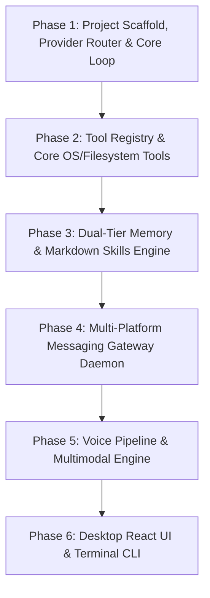

# 🚀 Makima v2 — Master Scratch Rebuild Blueprint
> **Architectural Pattern**: Nous Research Hermes Agent + Makima Dynamic Pareto Routing  
> **Status**: Approved by Ruflo Hive-Mind Swarm (Raft Consensus Quorum Reached)  
> **Target Platform**: Windows (Primary) & Cross-Platform POSIX Ready  
> **Cost Policy**: Free-Tier & Zero-Cost First (Google SDK primary + Free features for others, zero mandatory paid keys)  
> **Design Mandate**: Zero Hardcoding & 100% Dynamic Architecture  

---

## 🧭 Executive Vision

Makima v2 ek **persistent, self-improving, multi-platform autonomous AI assistant** banegi. 

Purani Makima v1 ke 3 sabse bade architectural flaws ko eliminate karna hai:
1. **No Monolithic God-Modules**: 4,300 LOC `system_tools.py` aur 2,900 LOC `sdk_bridge.py` ko chote, single-responsibility modular folders me todna.
2. **Native Tool-Calling Loop**: External heavyweight SDK bridges ki jagah Hermes-style transparent synchronous/async while-loop implement karna.
3. **Platform Gateway Daemon**: Chat session ke andar single-tool calls ki jagah standalone background gateway daemon jo ek saath Telegram, Discord, aur WhatsApp par active rahe.

---

## ⚡ The Zero-Hardcoding & 100% Dynamic Architecture Mandate
> **Strict Engineering Rule**: Codebase ke kisi bhi layer me models, tools, paths, prompt rules ya credentials hardcoded **nahi** honge. Har cheez modular, extensible, aur runtime-configured hogi.

1. **Dynamic Tool Auto-Discovery (`tools/**/`)**:
   - Agent ke paas tools ki koi static hardcoded list nahi hogi. Registry `importlib` aur `@tool` decorators se `tools/` directory ko scan karke sabhi tools ko dynamically load karegi. Naya tool file drop karte hi woh automatically discover ho jayega.
2. **Dynamic Model & Provider Detection**:
   - Koi bhi model name ya provider string code me hardcoded nahi hoga.
   - Env vars (`*_API_KEY`) aur `settings.yaml` se active providers dynamically detect honge.
   - Agar local Ollama active hai, toh `/api/tags` endpoint se locally available models dynamically probe honge.
3. **Dynamic Skills System (`~/.makima/skills/`)**:
   - Koi bhi skill Python code me hardcoded nahi hogi. User ya Agent `~/.makima/skills/` me koi bhi naya Markdown (`.md`) file save karega, engine use bina server restart kiye dynamically inject karega.
4. **Dynamic Platform & Environment Abstraction**:
   - Koi hardcoded OS path (jaise `C:\` ya `/home`) nahi hoga. `pathlib.Path.home()`, `platform.system()`, aur environment variables se runtime resolution hoga (Windows, macOS, Linux).
5. **Dynamic Context Budgeting**:
   - Token limits hardcoded numbers se nahi chalengi. Active model ki true context window (e.g. Gemini 1M vs DeepSeek 128k vs Ollama 8k) dynamically query hogi aur percentages (40% history, 25% memory, 15% tools, 20% response) proportionally allocate honge.
6. **Dynamic Host Capability Probing (`CapabilityProbe`)**:
   - System runtime par dynamically probe karega: *Kya Chrome installed hai? Kya Docker daemon active hai? Kya microphone plugged-in hai?* Aur prompt me live snapshot inject karega.
7. **Dynamic Prompts & Personas**:
   - Prompts Jinja2 templates aur user-editable `MEMORY.md` / `USER.md` se dynamically assemble honge — zero static prompt walls.

---

## ⚖️ Priority & Importance Matrix (Kisko Kitni Importance Deni Hai)

Ek production-grade agent build karne ke liye engineering effort ka allocation:

```
┌─────────────────────────────────────────────────────────────┐
│ Core Engine & Pareto Gateway (P0 - 35%)                     │
├──────────────────────────────────┬──────────────────────────┤
│ Modular Toolsets & Sandbox (25%) │ Messaging Gateway (15%)  │
├──────────────────────────────────┼──────────────────────────┤
│ Dual-Tier Memory & Skills (10%)  │ Voice & Multimodal (10%) │
├──────────────────────────────────┴──────────────────────────┤
│ Desktop UI & CLI Interfaces (P2 - 5%)                       │
└─────────────────────────────────────────────────────────────┘
```

| Subsystem | Priority | Importance Weight | Rationale |
|---|---|---|---|
| **Core Engine & Pareto Gateway** | **P0 (Critical)** | **35%** | Agar LLM dispatch, tool-calling loop, aur circuit breakers solid nahi honge toh baaki koi bhi feature stable nahi chalega. |
| **Modular Toolsets & Execution** | **P0 (Critical)** | **25%** | OS control, Terminal, Filesystem, Browser, aur Media tools agent ke actual "hands and eyes" hain. |
| **Messaging Gateway Daemon** | **P1 (High)** | **15%** | Hermes Agent ka killer feature: User phone (Telegram/WhatsApp) ya PC (Discord) se kahi bhi agent ko access kar sake. |
| **Dual-Tier Memory & Skills** | **P1 (High)** | **10%** | Persistent context (`MEMORY.md`, `USER.md`) aur Markdown-based self-learning jo agent ko intelligent banata hai. |
| **Voice & Multimodal System** | **P2 (Medium)** | **10%** | Gemini Live real-time speech + Edge-TTS notification audio. Desktop assistant ke liye great UX. |
| **Desktop UI & Rich CLI** | **P2 (Medium)** | **5%** | React WebSocket frontend aur Rich/Typer terminal interface. Engine stable hone ke baad plug hota hai. |

---

## 🛠️ Complete Feature Inventory (Jo Har Haal Me Hone Chahiye)

### 1. Model & Intelligence Gateway (Free-Tier & Zero-Cost First Policy)
- **Zero-Paid-Keys Guarantee**: User ko kisi bhi paid OpenAI ya Anthropic subscription ki zaroorat nahi hai.
  - **Primary Core**: Google GenAI SDK (Gemini 2.5 Flash free tier, Gemini 3.8 Live audio).
  - **OpenAI & Anthropic**: Sirf free tiers / free community endpoints use honge (e.g. OpenRouter free tier `openrouter/free`, free trial keys, ya standard mock/local fallbacks).
  - **Ultra-Fast Free Tier**: Groq Cloud free tier (Llama 3.3 70B at 300+ tok/s) & Cerebras free tier.
  - **100% Offline / Free**: Ollama (Qwen 2.5 Coder 7B, Llama 3.2 3B).
- **Dynamic Pareto Routing (Zero-Cost Optimized)**:
  - Fast Chat / Intent / Routing → Groq (Free Tier) / Gemini 2.5 Flash (Free Tier)
  - Code / Refactoring / Scripts → DeepSeek / Qwen 2.5 Coder (via Ollama or OpenRouter Free)
  - Vision & Multimodal → Gemini 2.5 Flash (Google AI Studio Free Tier)
  - Live Audio / Voice → Gemini 3.8 Live (Google SDK)
  - Offline Privacy Mode → Ollama local models
- **Circuit Breakers with Jitter**: 3 failures par provider auto-cooldown me jata hai, fallback cascade trigger hota hai (Gemini → Groq Free → OpenRouter Free → Ollama).
- **Token Budget & Compression**: Context window overflow hone se pehle middle conversation turns compress hoti hain, Head (instructions) aur Tail (recent context) intact rehte hain.

### 2. Autonomous Core Engine
- **Hermes-Style While-Loop**:
  - Model ko prompt + tool schemas bhejna.
  - Tool calls aane par execute karna.
  - Results append karke wapas model ko feed karna jab tak final answer na aaye.
- **Tool Fallback Recovery**: Agar koi tool fail ho (e.g., WhatsApp app band ho), model ko `[TOOL_FAILED: name] Alternative available: browser_navigate` signal mile taaki agent give up na kare.
- **Subagent Delegation**: Complex tasks ke liye child agent spawn karna (`spawn_subagent(task, tools, depth=1)`).

### 3. Modular Toolsets
- **OS Control (`tools/os/`)**:
  - `apps.py`: App search, launch, focus verification.
  - `windows.py`: Window focus, minimize, maximize, snap.
  - `processes.py`: Process monitor, CPU/RAM usage, safe process kill.
  - `system_info.py`: CPU, memory, battery, network diagnostics.
- **Filesystem & Sandbox (`tools/filesystem/`)**:
  - Safe read/write/delete with workspace boundary clamp (`cwd`).
  - Pre-state snapshot & **SAGA Rollback** (destructive edit se pehle backup lena taaki `undo` ho sake).
- **Terminal Execution (`tools/terminal/`)**:
  - Local async subprocess with timeout.
  - ConPTY integration (`pywinpty`) on Windows for interactive commands.
  - Docker sandbox backend support.
- **Web Browser (`tools/browser/`)**:
  - Playwright / Patchright (stealth anti-detect to bypass Cloudflare).
  - Browser-use autonomous goal execution.
  - CDP attach to user's active Chrome session.
- **Media Controller (`tools/media/`)**:
  - YouTube & Spotify playback, track change, volume control, ad-skip via DOM.
- **Document Generator (`tools/documents/`)**:
  - Excel (`.xlsx`) generation with openpyxl tables & charts.
  - Word (`.docx`) reports with python-docx.
  - PowerPoint (`.pptx`) slides with python-pptx.
  - PDF export via Playwright `page.pdf()` (clean, zero-C-DLL dependency).

### 4. Multi-Platform Messaging Gateway
- **Standalone Daemon (`makima gateway run`)**:
  - Telegram bot with voice memo transcription & image support.
  - Discord bot with slash commands & channel threads.
  - WhatsApp Web linked-device adapter.
  - Email listener (IMAP trigger + SMTP reply).
  - Allowlists & pairing code security (unauthorized users cannot use the bot).

### 5. Dual-Tier Memory & Self-Improving Skills
- **Tier 1 (Instant File Memory)**:
  - `~/.makima/MEMORY.md`: Project notes, instructions, long-term rules.
  - `~/.makima/USER.md`: User facts, preferences, habits.
- **Tier 2 (Episodic Archive)**:
  - SQLite WAL mode for chat turn lineage & task resumption.
  - `sqlite-vec` + `fastembed` for fast on-device semantic recall.
- **Skills System**:
  - Plain Markdown files in `~/.makima/skills/<name>/SKILL.md` with YAML frontmatter.
  - Agent can synthesize new skills from successful execution logs.

### 6. Voice & Real-Time Multimodal
- **Bidirectional Speech**: Gemini 3.8 Live API over WebSockets (16kHz PCM in, 24kHz PCM out) with native barge-in.
- **Zero-Key Neural TTS**: Edge-TTS (Ava/Jenny & Swara) for vocal responses.
- **Audio Hardware I/O**: `sounddevice` with pre-bundled PortAudio DLLs (crash-free on Windows).

### 7. Security & Guardrails
- **Prompt Injection Defense**: Sanitization & XML isolation framing on all external data (clipboard, web pages, window titles).
- **Dangerous Command Interceptor**: Intercept `rm -rf`, format drives, DROP TABLE.
- **Secret Leak Guard**: Shannon entropy scan (>4.5) to redact API keys before output is broadcast.

---

## 📅 Chronological Phased Roadmap (Sabse Pehle Kya Banana Chahiye)



---

### Phase 1: Foundation (Core Loop & Pareto Gateway) — *Days 1–2*
> **Goal**: Ek terminal script jo user prompt le, best LLM select kare, aur tool calling loop run kare.

1. **Scaffold Setup**:
   - `uv init makima-v2` with Python 3.12.
   - Configure clean `pyproject.toml` with pinned dependencies.
   - Create environment configuration (`config.py` using `pydantic-settings`).
2. **Provider Adapters & ParetoRouter (`makima/provider/`)**:
   - Implement `BaseProvider` interface with `generate()` and `stream()`.
   - Implement `OpenAICompatibleAdapter` (OpenAI, Groq, DeepSeek, Cerebras, Ollama).
   - Implement `GeminiAdapter` and `AnthropicAdapter`.
   - Build `ParetoRouter` with task cascades (`fast_chat`, `code`, `deep_reasoning`).
   - Implement `CircuitBreaker` with jittered cooldown.
3. **Core Agent Loop (`makima/core/engine.py`)**:
   - Clean while-loop with iteration cap (default 50).
   - Tool calling parsing & dispatch.
   - Context compression trigger when token budget exceeds 75%.

---

### Phase 2: Modular Toolsets & Execution Engine — *Days 3–4*
> **Goal**: Agent computer control kar sake (apps open karna, files modify karna, browser chalana).

1. **Tool Registry (`makima/tools/registry.py`)**:
   - Implement `@tool(name, description, tags)` decorator.
   - Auto-synthesize Pydantic / JSON schemas from function type hints.
2. **OS & System Tools (`makima/tools/os/`)**:
   - Port and modularize: `apps.py`, `windows.py`, `processes.py`, `system_info.py`.
   - Windows-safe wrappers using `psutil`, `pywin32`, and `tzdata`.
3. **Filesystem & Terminal Tools (`makima/tools/system/`)**:
   - File read/write/edit with workspace boundary security.
   - Safe command runner with timeout and ConPTY on Windows.
   - SAGA pre-state snapshot for file undo.
4. **Browser & Media Tools (`makima/tools/browser/`, `tools/media/`)**:
   - Playwright / Patchright browser automation.
   - YouTube & Spotify controller via browser DOM.
   - OpenPyXL / Python-DOCX document generation.

---

### Phase 3: Dual-Tier Memory & Self-Improving Skills — *Day 5*
> **Goal**: Agent user ke preferences yaad rakhe aur naye tasks se skills seekhe.

1. **Dual-Tier Memory (`makima/memory/`)**:
   - `state.py`: Reads `~/.makima/MEMORY.md` and `~/.makima/USER.md`, injects into system prompt.
   - `episodic.py`: Async SQLite WAL database via `aiosqlite` for session history.
   - `search.py`: Fast semantic retrieval using `sqlite-vec` + `fastembed`.
2. **Skills System (`makima/skills/`)**:
   - Markdown skill loader (`~/.makima/skills/**/*.md`).
   - Skill synthesis tool: Jab multi-step goal complete ho, agent `save_skill()` call karke Markdown doc generate kare.

---

### Phase 4: Multi-Platform Messaging Gateway Daemon — *Days 6–7*
> **Goal**: Makima Telegram, Discord, aur WhatsApp par 24/7 active rahe.

1. **Gateway Engine (`makima/gateway/server.py`)**:
   - Standalone daemon runner with background task supervisor.
   - Security allowlist (only authorized user IDs can command the agent).
2. **Platform Adapters (`makima/gateway/adapters/`)**:
   - Telegram bot via `python-telegram-bot`.
   - Discord bot via `discord.py`.
   - WhatsApp Web bridge via linked device / Baileys.
   - Inbound email listener via `aioimaplib` / `aiosmtplib`.
3. **Task Automation & Cron**:
   - `APScheduler` integration for recurring tasks and reminders.

---

### Phase 5: Voice & Multimodal Audio — *Day 8*
> **Goal**: User Makima se bolkar baat kar sake.

1. **Speech-to-Speech Engine (`makima/voice/`)**:
   - Gemini 3.8 Live API integration over WebSockets for real-time conversation.
   - Edge-TTS fallback for voice notifications.
   - `sounddevice` for low-latency microphone capture and speaker playback.
   - Wake word listener ("Hey Makima").

---

### Phase 6: Interfaces & Polish — *Day 9*
> **Goal**: Premium desktop experience.

1. **FastAPI & WebSocket Server (`makima/api/`)**:
   - Real-time streaming API endpoint (`/ws`).
   - Health and telemetry endpoints.
2. **Desktop UI (`makima/ui/`)**:
   - React + TypeScript + Vite frontend.
   - Chat bubbles, live tool execution progress, canvas code viewer.
3. **Rich CLI (`makima/cli/`)**:
   - `makima chat`: Terminal chat mode like Hermes CLI.
   - `makima gateway run`: Start background daemon.
   - `makima tools list`: List active tool registry.

---

## 🗂️ Proposed Clean Directory Structure

```
makima_v2/
├── pyproject.toml              # Exact verified dependencies
├── README.md                   # Setup & quickstart guide
├── MASTER_PLAN.md              # Complete build plan
├── RESOURCES_MANIFEST.md       # Complete SDK, tool & model catalog
├── configs/
│   └── settings.yaml           # Unified system configuration
│
├── makima/
│   ├── __init__.py
│   ├── config.py               # Pydantic Settings (dynamic)
│   │
│   ├── core/                   # Autonomous Agent Brain
│   │   ├── engine.py           # While-loop tool-calling engine (<350 LOC)
│   │   ├── context.py          # Token budget & middle-turn compressor
│   │   ├── subagent.py         # Subagent delegation runner
│   │   └── guardrails.py       # Prompt injection & secret leak defense
│   │
│   ├── provider/               # Model Routing & Adapters
│   │   ├── router.py           # ParetoRouter (dynamic cost/latency cascades)
│   │   ├── circuit_breaker.py  # Jittered failure protection
│   │   ├── base.py             # BaseProvider interface
│   │   └── adapters/           # OpenAI, Gemini, Anthropic, Ollama
│   │
│   ├── tools/                  # Modular Self-Registering Toolsets
│   │   ├── registry.py         # @tool decorator & schema extractor
│   │   ├── os/                 # apps.py, windows.py, processes.py, system.py
│   │   ├── filesystem/         # safe_io.py, saga_rollback.py
│   │   ├── terminal/           # subprocess_runner.py, conpty_win.py
│   │   ├── browser/            # playwright_driver.py, patchright_stealth.py
│   │   ├── media/              # youtube.py, spotify.py
│   │   └── documents/          # excel.py, docx.py, pdf_export.py
│   │
│   ├── gateway/                # Multi-Platform Hermes Gateway
│   │   ├── server.py           # Long-running gateway daemon runner
│   │   ├── security.py         # User allowlists & pairing codes
│   │   ├── scheduler.py        # APScheduler cron & reminders
│   │   └── adapters/           # telegram.py, discord.py, whatsapp.py, email.py
│   │
│   ├── memory/                 # Dual-Tier Memory
│   │   ├── state.py            # MEMORY.md & USER.md loader
│   │   ├── episodic.py         # SQLite WAL turn store
│   │   └── vector_search.py    # fastembed + sqlite-vec semantic search
│   │
│   ├── skills/                 # Self-Improving Skills
│   │   ├── loader.py           # Markdown frontmatter loader
│   │   ├── synthesizer.py      # Trajectory-to-skill generator
│   │   └── builtins/           # Pre-shipped skill docs
│   │
│   ├── voice/                  # Multimodal Voice Engine
│   │   ├── gemini_live.py      # Real-time WebSocket audio
│   │   ├── edge_tts.py         # Neural TTS fallback
│   │   └── audio_io.py         # sounddevice mic/speaker streams
│   │
│   ├── api/                    # FastAPI & WebSockets
│   │   ├── app.py              # Server lifespan & REST API
│   │   └── ws.py               # Live WebSocket stream bridge
│   │
│   └── cli/                    # Rich Terminal Interface
│       └── main.py             # Typer CLI entrypoints
│
└── tests/                      # Fast unit & integration tests
```

---

## 🛡️ Critical Windows-Specific Engineering Guardrails

1. **Subprocess PTY**: Windows par raw pipes interactive programs me freeze ho jate hain. Interactive commands ke liye `pywinpty` ConPTY use karein.
2. **Audio Stability**: `pyaudio` Windows pe MSVC build tools ke bina crash hota hai; hamesha `sounddevice` use karein (pre-bundled DLLs).
3. **PDF Generation**: `weasyprint` Windows pe MSYS2/GTK maangta hai; hamesha Playwright `page.pdf()` ya `reportlab` use karein.
4. **Timezone Accuracy**: Windows pe Python `zoneinfo` crash na ho isliye `tzdata` package dependency list me zaroori hai.
5. **Log File Rotation**: Windows file locking handle karne ke liye `concurrent-log-handler` use karein taaki multi-process gateway me crashes na hon.
6. **Desktop Browser Visibility**: Browser automation launch karte waqt `headless=False` rakhein taaki user ko desktop par browser activity live dikhe.
